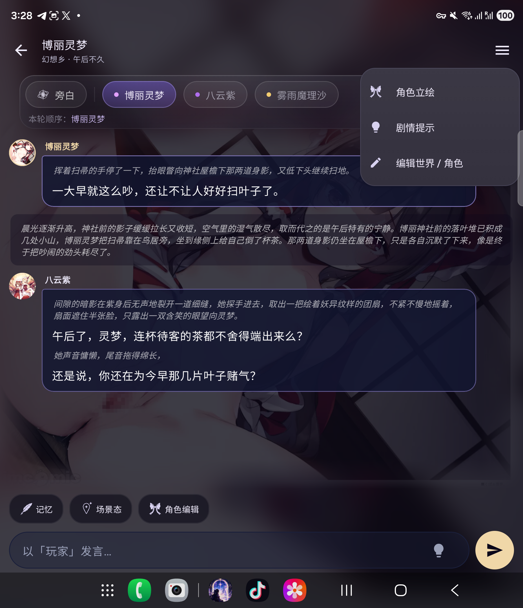

# 幻境 Mirage

Android 角色聊天应用。当前交付版本：**v1.1.31（91）**，2026-09-25 收官版。

## 下载

请在 [v1.1.31 发布页](https://github.com/qq749937207-ux/jiangzhemintobgzhi/releases/tag/v1.1.31) 下载：

- Mirage-v1.1.31.apk（幻境）：保留现有名称和启动图标，可覆盖当前同签名安装。
- rp-android-batch-v1.1.31.zip：完整源码、构建脚本、资源、APK、测试记录及交接文档。
- 对应 .sha256 文件：用于验证下载完整性。

## 本版

- 灵梦蝴蝶结与缎带简化图标；三个功能图标统一可见尺寸和颜色。
- 聊天右上菜单改为冷紫圆角风格，保留三个原有功能入口。
- 包含设置 UI 改动、世界独立记忆、三个功能卡片及实时场景态副标题。
- 构建成功，10 项仪器测试通过，已在 Fold 6 覆盖安装核对。

## 文档

- [完整交接及迁移说明](docs/HANDOFF-batch-v1.1.31.md)
- [改动与 AI 图标生成记录](docs/PATCH-NOTES-batch-v1.1.31.md)
- [归档内容索引](docs/ARCHIVE-INDEX-v1.1.31.md)

迁移包不包含手机私人数据库、聊天数据和接口密钥。换设备前请使用应用内「数据与备份」导出所需数据。APK 沿用开发测试签名，未配置商店发布签名。

## 真机效果

